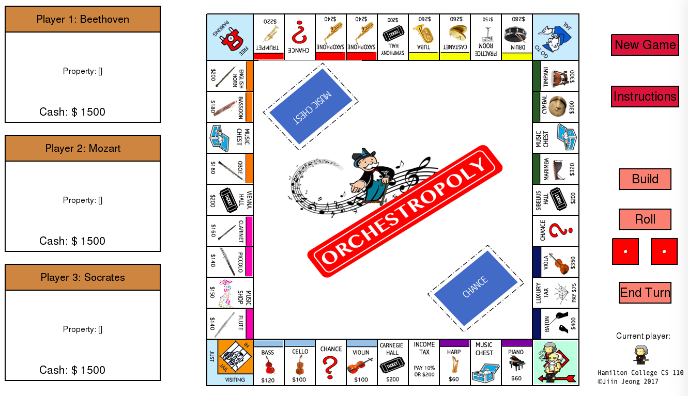

# Orchestropoly
Monopoly for music-lovers using Python (Nov - Dec 2017)

This repository only contains the game logic code. To run the program, you need Hamilton's CS110-graphics library as well as image files for the Orchestropoly tiles and player sprites.

